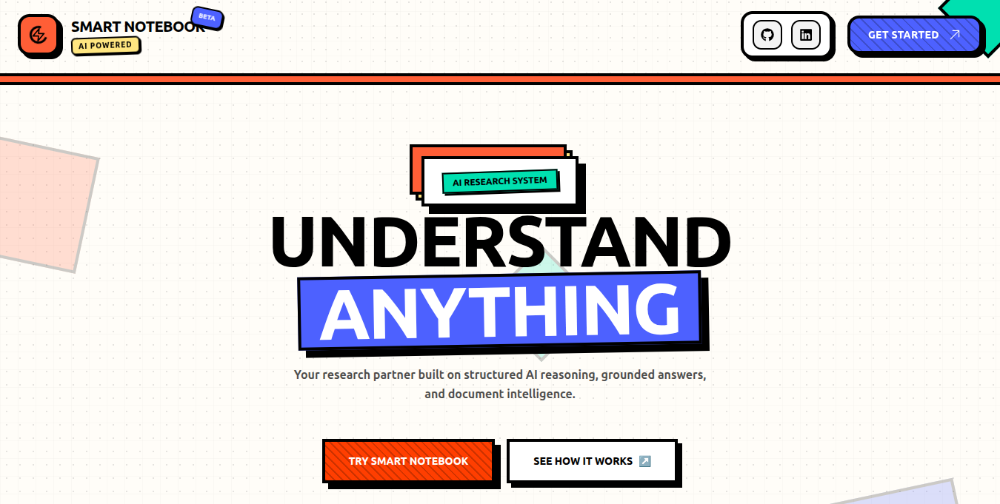
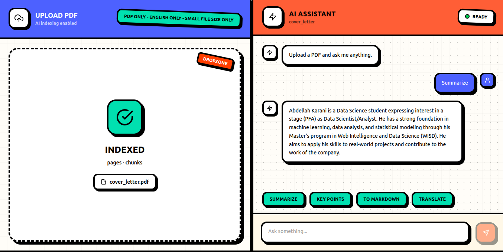

# Smart Note Book

### Learn smarter, retrieve anywhere:
An intelligent note-taking experience powered by RAG.

[](https://github.com/KaraniAbdellah)
[](https://x.com/karani66745)
[](https://www.linkedin.com/in/abdellah-karani-965928294/)

**[Getting Started](#how-to-start-the-project) • [Core Features](#features) • [Architecture](#architecture) • [Project Structure](#project-structure)**

Smart Note Book brings you **Retrieval-Augmented Generation (RAG)**. It is a digital notebook designed to encode your specific context. This means if you search the internet for information but your PDF documents are complex, you can simply upload your notebook. You will get an AI assistant that provides accurate responses based directly on your PDF files.

The best part is the **context-aware AI**. Scrolling through endless pages is distracting. Ask your notebook anything, and it will instantly give you answers based *only* on your personal documents.

**Live Link:** [https://smart-notebook-chi.vercel.app/](https://smart-notebook-chi.vercel.app/)

---

## Screens

<br/>
<br/>



---

## Architecture

```text
Frontend (React)
      ↓
FastAPI Backend
      ↓
RAG Pipeline (Python)
      ↓
ChromaDB (Vector Store)
      ↓
Embedding Model
      ↓
Relevant Context Returned → LLM Response
```

---

## Features

- 🔍 **Hybrid Search** — Semantic search + keyword search
- 🧠 **Document-Grounded** — AI answers based only on your uploaded documents
- 📄 **Smart Ingestion** — PDF and text chunk ingestion
- ⚡ **Advanced RAG** — HyDE (Hypothetical Document Embeddings) for better retrieval
- 🧩 **Local-First** — Local development setup using ChromaDB
- 🌐 **Groq API** — Fast inference and responses using Groq API
- 💬 **User-Friendly** — Clean, chat-style interface

---

## Project Structure

```plaintext
├── frontend          # The user interface built with React
├── backend           # FastAPI backend configuration using ChromaDB
├── deployed_backend  # Deployed API setup (uses standard lists instead of ChromaDB due to deployment constraints)
└── rag_app           # Core RAG pipeline files built from scratch
```

---

## How to Start the Project

### 1. Start the Frontend

Navigate to the `note_smart_frontend` folder and run:

```bash
npm start
```

### 2. Start the Backend

Navigate to the `backend` folder and run the Uvicorn server:

```bash
uvicorn app:app --host 0.0.0.0 --port 8000 --reload
```

